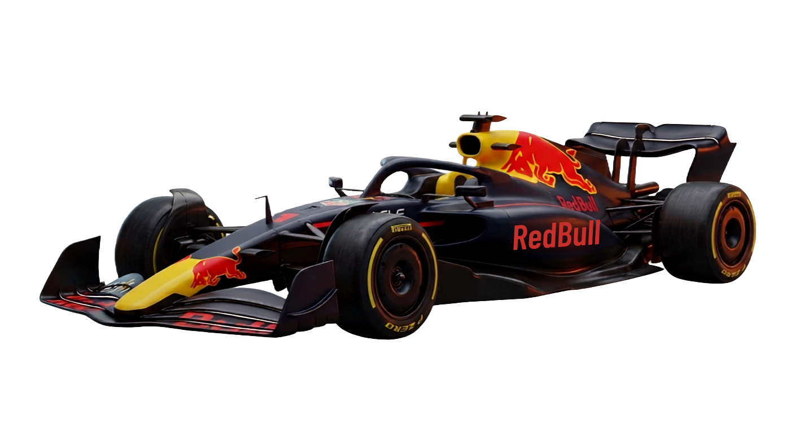
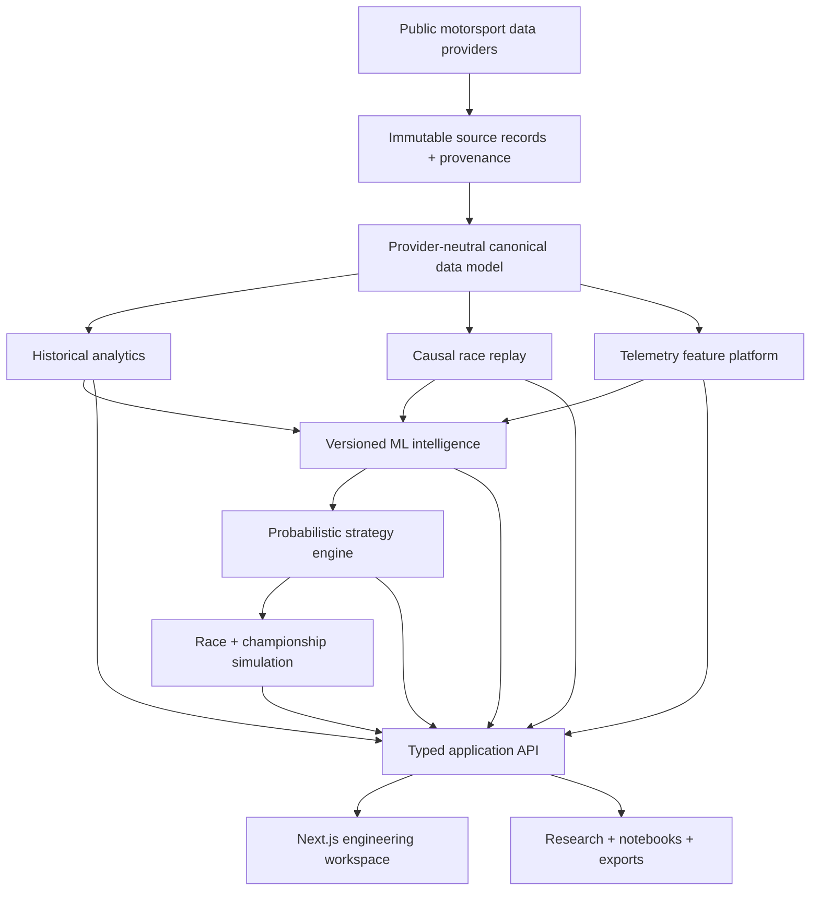

# DOWNFORCE

### Race Intelligence, Before the Outcome.

[](https://github.com/Rachit-2216/DOWNFORCE/actions/workflows/ci.yml)



DOWNFORCE is an open-source Formula 1 intelligence platform for exploring decades of race history,
replaying races as they unfolded, inspecting telemetry at engineering depth, modelling driver and
car performance, testing strategy decisions, simulating complete race and championship futures,
and researching the sport through traceable evidence.

It is one connected system rather than a collection of dashboards. Historical observations flow
through a canonical data model into analytics, replay, telemetry, machine learning, strategy,
simulation, and research tools while preserving provenance and uncertainty at every boundary.

> DOWNFORCE never mixes what happened with what a model predicted or a simulation imagined.

## Platform

| System                              | What it provides                                                                                                                   |
| ----------------------------------- | ---------------------------------------------------------------------------------------------------------------------------------- |
| **Historical Database**             | Searchable seasons, races, drivers, constructors, circuits, classifications, laps, pits, conditions, and capability-aware coverage |
| **Race Replay Engine**              | Causal reconstruction of exactly what was knowable at any point in a Grand Prix                                                    |
| **Telemetry Engineering Lab**       | Synchronized lap traces, track position, corner analysis, micro-sectors, and time-gain/loss inspection                             |
| **Performance Intelligence**        | Calibrated pace, tyre, pit-loss, driver, constructor, and circuit-aware predictive models                                          |
| **Strategy Engineering Lab**        | Probabilistic pit-window search, undercut/overcut analysis, strategy frontiers, and scenario sensitivity                           |
| **Race and Championship Simulator** | Full-grid Grand Prix worlds, generated replays, counterfactuals, and title-outcome distributions                                   |
| **F1 Research Platform**            | Natural-language research, structured queries, evidence links, notebooks, exports, and shareable analyses                          |

## A single evidence model

Every number in DOWNFORCE belongs to one explicit evidence class:

| Class              | Meaning                                                              |
| ------------------ | -------------------------------------------------------------------- |
| **Observed**       | A value retained from a source record                                |
| **Derived**        | A deterministic calculation from observed evidence                   |
| **Predicted**      | A model estimate with identity, inputs, calibration, and uncertainty |
| **Simulated**      | One or many stochastic futures under declared assumptions            |
| **Counterfactual** | A historical decision changed at a defined causal boundary           |

Unsupported evidence is reported as **Unavailable**. Close strategy outcomes return **No clear
preference**. Predictions include uncertainty, simulations expose their assumptions, and historical
replay never reads information from beyond its active race cursor.

## Historical archive and analytics

The historical platform turns the Formula 1 record into a capability-aware analytical archive.
Every era exposes only the evidence it genuinely supports.

- Explore seasons, Grands Prix, circuits, drivers, constructors, countries, and data capabilities.
- Inspect final classifications, grids, wins, podiums, race points, reliability, and participation.
- Follow driver and constructor progression through a season.
- Compare drivers over common races or genuine teammate events.
- Study constructor performance without silently inventing team lineage.
- Analyze circuit history across event-name changes and canonical venue identities.
- Review position progression, raw lap distributions, biggest movers, and pit activity.
- Rank entities with explicit minimum samples, denominators, quality policy, and era-aware coverage.
- Trace aggregates back to the races and source observations that produced them.

Historical scoring systems are preserved from recorded race evidence rather than reconstructed with
modern rules. Missing pit, tyre, weather, or telemetry capability remains missing instead of being
converted to zero or synthetic data.

## Historical race replay

Choose a race and move the authoritative cursor to any lap or timestamp. DOWNFORCE rebuilds the
race state using only evidence available at that moment.

Replay workspaces include focused modes for:

- **Track** — field position and selected-driver movement.
- **Timing** — order, gaps, intervals, laps, and status.
- **Stints** — compounds, tyre age, stint boundaries, and pit history.
- **Events** — pits, overtakes, flags, race control, and session chronology.
- **Conditions** — weather, track state, and session status.
- **Driver** — one driver's causal history and intelligence context.

All panels share the same race cursor. Scrubbing backward produces the same state every time;
scrubbing forward never changes what the past was allowed to know.

## Telemetry Engineering Lab

The telemetry workspace synchronizes engineering channels by time and lap distance so two laps can
be compared without hiding alignment or source limitations.

- Speed, RPM, gear, throttle, brake, DRS, distance, and elapsed-time traces.
- X/Y/Z position data and a synchronized circuit map where supported.
- Cumulative time-delta traces showing where a lap was gained or lost.
- Entry speed, minimum speed, exit speed, braking onset, release, throttle pickup, gear, and corner
  traversal time.
- Micro-sector gain/loss maps across the circuit.
- Driver-versus-driver, teammate, and same-driver lap comparisons.
- Practice, qualifying, sprint, and race comparisons with compound, weather, session, and fuel
  uncertainty kept visible.
- Same-stint and same-compound degradation inspection.

Telemetry is never fabricated for an era or session that does not contain it, and public feeds are
never described as equivalent to a team's private sensor suite.

## Performance Intelligence

DOWNFORCE models performance as a distribution, not a guaranteed lap time.

- Next representative lap, short-horizon pace, and stint-level pace.
- Tyre degradation, compound behaviour, tyre-age response, stint uncertainty, and cliff-risk
  indicators.
- Effective pit-loss distributions with circuit and race-control context.
- Driver, constructor, circuit, season, weather, traffic, gap, and race-phase effects.
- Circuit descriptors for length, corner mix, high-speed fraction, braking intensity, straights,
  average speed, and tyre-stress proxies.
- Model registry, immutable artifacts, feature contracts, dataset identities, calibration reports,
  and reproducible inference.

Validation holds out complete events, seasons, circuits, and driver/team combinations. Temporal,
circuit, regulation-shift, and event-level tests are preferred to random-row splits, with baselines
and failure modes reported alongside aggregate scores.

## Strategy Engineering Lab

The strategy workspace asks which decisions remain strong across plausible race futures.

- Search complete one-stop and two-stop windows rather than evaluating one hand-picked alternative.
- Compare expected finish, win/podium probability, downside, variance, and robustness.
- Visualize pit-window curves, two-stop heatmaps, and expected-result versus risk frontiers.
- Evaluate undercut, overcut, compound, and stint-length choices against selected rivals.
- Model opponent pit timing, traffic, overtaking probability, circuit difficulty, and DRS trains.
- Inject Safety Car, Virtual Safety Car, red flag, weather, and tyre-crossover scenarios.
- Expose sensitivity to pace, degradation, pit-loss, traffic, and uncertainty assumptions.
- Backtest recommendations against historical decision points without tuning on future outcomes.

A recommendation is stated conditionally: under the declared assumptions and uncertainty
distributions, one strategy has the strongest simulated outcome. DOWNFORCE does not claim to know a
single guaranteed optimal strategy.

## Race and championship simulation

Simulations can begin from the starting grid, a historical replay cursor, or a declared scenario.
Each Monte Carlo world evolves the complete field through pace variation, tyre behaviour, traffic,
overtaking, DRS, pit policy, race control, weather, and reliability assumptions.

For every driver, DOWNFORCE can report:

- Finishing-position distribution.
- Win, podium, points, and DNF probability.
- Expected finish and expected race time.
- Best-case, median, worst-case, and selected simulation paths.

Simulation modes scale from quick interactive runs to asynchronous research jobs. Any generated
world can be opened in the replay interface, allowing actual and counterfactual races to be watched
through the same timing, track, stint, event, and condition views.

Championship simulation extends those mechanics across the remaining calendar:

- Driver and constructor title probabilities.
- Required-results and clinching scenarios.
- Fastest-lap, sprint, and event-format rules for the relevant season.
- User-defined race outcomes and alternative historical results.
- Season-level counterfactuals with traceable changes from the recorded championship.

## Research, notebooks, and sharing

Ask a Formula 1 question in natural language and DOWNFORCE compiles it into structured analytics,
telemetry, model, or simulation operations. Answers are generated from typed results rather than
unsupported narrative inference.

- Query seasons, drivers, constructors, circuits, races, telemetry, intelligence, and simulations.
- Open the exact races, laps, traces, or simulation paths supporting a claim.
- Generate charts from structured data and retain the query that produced them.
- Save mixed analytics, telemetry, strategy, and championship work in research notebooks.
- Create shareable analysis links with stable data, model, and scenario identities.
- Export supported results as CSV, JSON, images, and reports.
- Move directly from a research result into replay, telemetry comparison, or strategy simulation.

## Architecture



The canonical archive is immutable. Derived datasets and model artifacts carry source versions,
schema versions, checksums, feature contracts, and deterministic identities. Production storage can
separate the catalog database, object storage, job queue, and simulation workers; local development
uses the ignored `.downforce/` workspace.

## Technology

| Layer        | Technology                                                              |
| ------------ | ----------------------------------------------------------------------- |
| Web          | Next.js, React, TypeScript, React Three Fiber, accessible responsive UI |
| API          | FastAPI, Pydantic, typed error contracts, OpenAPI                       |
| Data         | Python, Arrow, Parquet, immutable source and canonical datasets         |
| Intelligence | Versioned features, calibrated ML artifacts, deterministic inference    |
| Simulation   | Seeded Monte Carlo engines, asynchronous research-scale workers         |
| Quality      | Pytest, Vitest, Playwright, Ruff, mypy, ESLint, Prettier, CI            |

## Repository structure

```text
DOWNFORCE/
├── apps/
│   ├── api/                 # FastAPI application and public boundaries
│   └── web/                 # Next.js product experience
├── packages/
│   └── downforce_core/      # Canonical data, replay, analytics, ML, and simulation domain
├── artifacts/               # Reviewed, versioned model artifacts and registries
├── data/                    # Data policy and small metadata only
├── scripts/                 # Ingestion, validation, benchmarking, and operations
└── .downforce/              # Local data, caches, features, jobs, and simulations (ignored)
```

## Run locally

### Requirements

- Git
- Node.js 20.9 or newer
- pnpm 10.27 through Corepack
- Python 3.12 or newer
- [uv](https://docs.astral.sh/uv/)

### 1. Clone and install

```bash
git clone https://github.com/Rachit-2216/DOWNFORCE.git
cd DOWNFORCE
corepack enable
pnpm install --frozen-lockfile
uv sync --frozen
```

### 2. Configure the applications

macOS/Linux:

```bash
cp .env.example .env
```

Windows PowerShell:

```powershell
Copy-Item .env.example .env
```

The default configuration serves the web application at `http://localhost:3000` and the API at
`http://127.0.0.1:8000`. Set `NEXT_PUBLIC_API_URL` and the `DOWNFORCE_*` variables in `.env` when
using different origins or runtime settings.

### 3. Build the historical workspace

Runtime datasets are intentionally not stored in Git. Synchronize completed Grand Prix history,
validate it, and build the local analytics store:

```bash
uv run python -m downforce_core.cli --root . archive sync --start-year 2000 --completed-only
uv run python -m downforce_core.cli --root . archive validate
uv run python -m downforce_core.cli --root . analytics rebuild
```

Detailed timing and telemetry sessions can be added independently. For example:

```bash
uv run python -m downforce_core.cli --root . ingest --season 2024 --event British --session Race
```

Provider downloads can take time and remain subject to provider availability, rate limits, terms,
and data coverage. All downloaded and generated runtime material stays under `.downforce/`.

### 4. Start DOWNFORCE

Run the API and web application in separate terminals:

```bash
pnpm dev:api
```

```bash
pnpm dev:web
```

Open:

- Product: [http://localhost:3000](http://localhost:3000)
- API health: [http://127.0.0.1:8000/health](http://127.0.0.1:8000/health)
- Interactive API schema: [http://127.0.0.1:8000/docs](http://127.0.0.1:8000/docs)

### Production build

```bash
pnpm build
pnpm --dir apps/web start
```

Run the production API separately:

```bash
uv run uvicorn app.main:app --app-dir apps/api --host 0.0.0.0 --port 8000
```

## Application areas

| Area                              | Entry point                      |
| --------------------------------- | -------------------------------- |
| Product introduction              | `/`                              |
| Explore seasons and races         | `/app`                           |
| Historical analytics              | `/app/analytics`                 |
| Driver and constructor comparison | `/app/analytics/compare`         |
| Historical rankings               | `/app/analytics/rankings`        |
| Race replay workspace             | `/app/events/:eventId/workspace` |
| Telemetry Lab                     | `/app/telemetry`                 |
| Performance intelligence          | `/app/intelligence`              |
| Strategy Lab                      | `/app/strategy`                  |
| Race simulation                   | `/app/simulate`                  |
| Championship scenarios            | `/app/championship`              |
| Research and notebooks            | `/app/research`                  |

The typed API exposes equivalent domains for seasons, events, drivers, constructors, circuits,
analytics, replay, telemetry, intelligence, strategy, simulation, championships, and research.

## Quality and reproducibility

Run the complete repository checks:

```bash
pnpm lint
pnpm typecheck
pnpm test
pnpm build
```

Individual Python checks:

```bash
uv run pytest
uv run ruff check apps/api packages/downforce_core scripts
uv run ruff format --check apps/api packages/downforce_core scripts
uv run mypy apps/api packages/downforce_core/src scripts
```

Reproducibility is part of the product contract:

- Immutable raw evidence and revisioned canonical data.
- Schema, dataset, feature, model, and simulation identities.
- Seeded probabilistic runs.
- Train, validation, calibration, and test separation.
- Historical-cursor leakage protection.
- Coverage and quality metadata on public aggregates.
- Model serialization and reload equivalence.
- Browser, API, data, ML, strategy, and simulation regression gates.

## Contributing

DOWNFORCE welcomes improvements to data engineering, analytics, telemetry processing, modelling,
simulation, visualization, accessibility, documentation, and motorsport research.

1. Fork the repository and create a focused branch.
2. Keep observed, derived, predicted, simulated, and counterfactual data contracts explicit.
3. Add tests and reproducible evidence for behavioural or metric changes.
4. Run the complete quality suite.
5. Open a pull request describing the problem, method, validation, and limitations.

Do not commit provider downloads, credentials, local caches, generated simulations, or data whose
terms do not permit redistribution.

## Data, accuracy, and attribution

DOWNFORCE uses public and community-accessible motorsport data according to each provider's terms.
Availability and precision vary by season, session, circuit, channel, and source. Analyses should be
interpreted within the coverage, assumptions, and uncertainty displayed by the platform.

DOWNFORCE is an independent, unofficial project. It is not associated with Formula 1, the FIA, any
team, constructor, driver, or data provider. Formula 1 and related marks belong to their respective
owners. Nothing in DOWNFORCE represents team-grade private telemetry, engineering advice, betting
advice, or a guarantee of future sporting outcomes.
